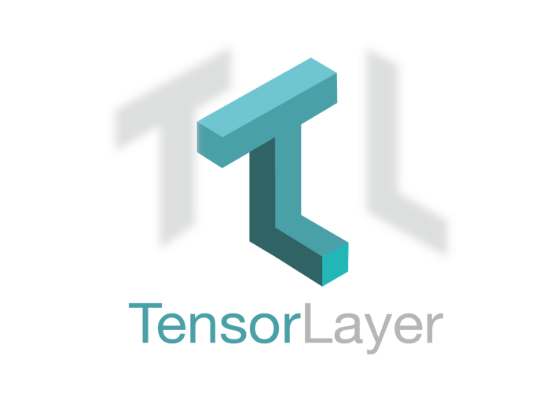

As we are moving towards the next leap in deep learning, there has been a lot of progress on the engineering front, esp the framework front. Within the past few years, we have seen a **huge number of machine learning libraries and frameworks** to enable us to build machine learning models — faster, scalable and accessible.

**Two of the most prominent of these frameworks are — TensorFlow and PyTorch**. While it is incredibly tempting to do a side by side comparison for both but I think, to sum it up, one can say that **PyTorch is easier to use, lighter and flexible** (dynamic computational graph) whereas **TensorFlow is a complete production level tool.** While it has more abstractions and a steep learning curve but it is extremely powerful and tops everything else when it comes to scalability for your deep learning models.

When working with deep learning models however, this low-level architecture mastery for TensorFlow and the high-level architecture mastery for deep learning can seem like a ridiculously tall order.

It leads to an **abstraction gap** that demands for some bridging tools. These bridging tools need to fulfill few key requirements in order to be
effective:

1. Simplicity
2. Flexibility
3. Functionality
4. Portability
5. Scalability
6. Performance

Thus, over the past few years a few excellent **bridging tools and libraries** have been developed. These include **TensorLayer, Keras, TFLearn etc.**

But do they compare?

## So what is TensorLayer?

[TensorLayer](https://tensorlayer.readthedocs.io/en/latest/), is a part of Google’s popular machine learning and numerical computational framework [TensorFlow](https://www.tensorflow.org/). It provides popular Deep Learning and Reinforcement Learning modules
that can be easily customized and assembled for tackling real-world machine learning problems. The idea behind this library was to facilitate a modular approach to Deep Learning as well as Reinforcement Learning to tackle complex as well as iterative tasks for when it comes to large neural networks and their interactions.

## How?

1. It provides high-level state-of-the-art deep learning modules

2. It enables the users to build a model using native TensorFlow APIs

Also,

3. It enables the users to define their own computational operations

4. It enables the users to define their own training logic

5. The users can glue different modules together (e.g., connected with [TF-Slim](http://tensorlayer.readthedocs.io/en/latest/modules/layers.html#connect-tf-slim) and [Keras](http://tensorlayer.readthedocs.io/en/latest/modules/layers.html#connect-keras)).

6. It provides **zero-cost** abstraction (or negligible overhead)

7. It allows easy scaling of your models from laptops to clouds.

> In fact, it is because of these incredibly powerful features that TensorLayer was awarded the 2017 Best Open Source Software by the prestigious ACM Multimedia Society.

## Quick Recap:

1. **Speed:** It is basically designed in order to speed-up experimentation and developments by providing a higher-level API to [TensorFlow](https://www.techleer.com/articles/486-presenting-to-you-the-second-annual-tensorflow-dev-summit-2018/).
2. **Flexibility:** TensorLayer APIs are transparent in nature hence leaving the user with massive hooks that support diverse low-level tuning.
3. **Customizable**: TensorLayer is quite easily extensible as well as modifiable.
4. **Zero-cost Abstraction:** TensorLayer has the ability to achieve the performance of TensorFlow at its fullest.
5. **Modular Reference Layers:** The highlighting feature of TensorLayer lies in the IDE-like approach where the host of operations such as [neural networks](https://analyticsindiamag.com/how-synthetic-gradients-are-used-to-optimise-training-of-large-neural-networks/), their states, data and other parameters are assorted into easily accessible modules.
6. **When compared with TensorFlow**, TensorLayer closely [fares the same](https://arxiv.org/pdf/1707.08551.pdf) when classic ML models of neural networks are performed. Although it might look like a setback, it allows the layer module in TensorLayer to cater to customized models. But on the other hand, it uses indexing concepts for quicker row selection while handling datasets. Also, the cache is stored locally to handle workloads with larger data for optimal performance. In addition, it also helps the workflow module to implement Deep Learning models using [‘asynchronous training](https://www.tensorflow.org/deploy/distributed)’.

## How does TensorLayer Work?

TensorLayer relies on TensorFlow’s computational engine for training using MongoDB as the storage backend.

Citations:

1. ArXiv Paper: [TensorLayer: A Versatile Library for Efficient Deep Learning Development](https://arxiv.org/abs/1707.08551)
2. [TensorLayer Documentation](https://tensorlayer.readthedocs.io/en/latest/index.html)
3. [What Is TensorLayer And How Is It Different From TensorFlow’s Other Machine Learning Libraries?](https://analyticsindiamag.com/what-is-tensorlayer-and-how-is-it-different-from-tensorflows-other-machine-learning-libraries/)
4. [Presenting TensorLayer for Researchers and Engineers: A transparent Deep Learning and Reinforcement Learning Library](https://www.techleer.com/articles/503-presenting-tensorlayer-for-researchers-and-engineers-a-transparent-deep-learning-and-reinforcement-learning-library/)
